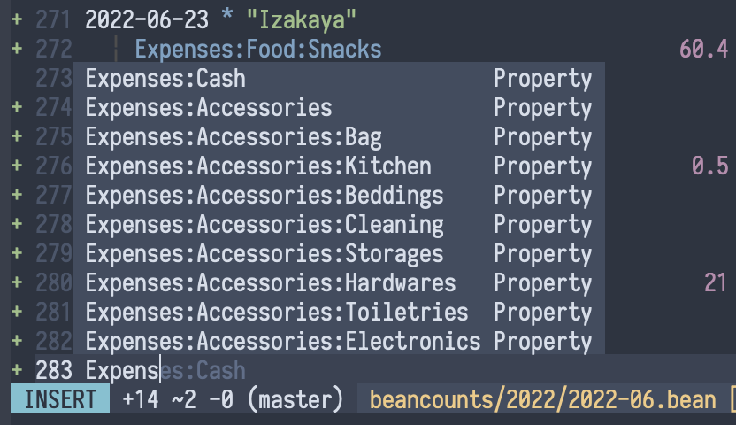

# cmp-beancount

nvim-cmp source for beancount accounts.

cmp-beancount completes based on prefix and prefix abbreviation (e.g. `E:A:E` to `Expenses:Accessories:Electronics`) of beancount account names.




## Setup

Prerequisites:

```shell
pip3 install neovim
pip3 install beancount
```

Install with your favorite package manager:
```lua
use('crispgm/cmp-beancount')
```

Then, setup completion source:
```lua
require('cmp').setup {
  sources = {
    {
      name = 'beancount',
      option = {
        account = '/path/to/account.bean'
      }
    }
  }
}
```

## License

MIT
